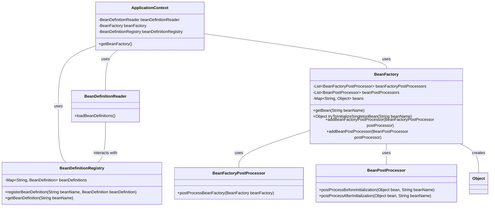
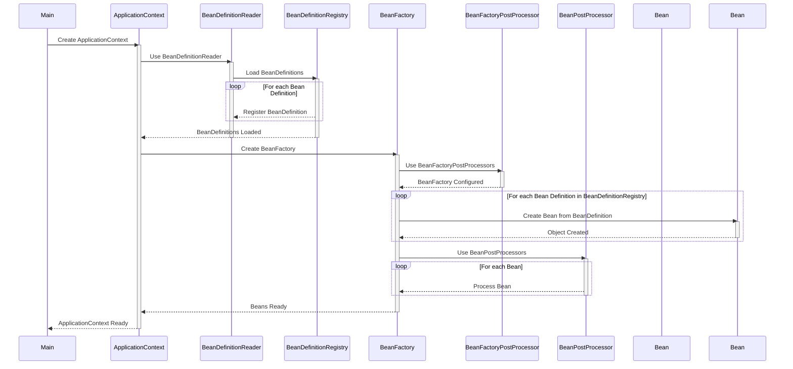

## BRING Basic Context Class Diagram (IoC Container)

```mermaid
classDiagram
    class ApplicationContext {
        -BeanDefinitionReader beanDefinitionReader
        -BeanFactory beanFactory
        -BeanDefinitionRegistry beanDefinitionRegistry
        +getBeanFactory()
    }

    class BeanDefinitionReader {
        +loadBeanDefinitions()
    }

    class BeanDefinitionRegistry {
        -Map~String, BeanDefinition~ beanDefinitions
        +registerBeanDefinition(String beanName, BeanDefinition beanDefinition)
        +getBeanDefinition(String beanName)
    }

    class BeanFactory {
        -List~BeanFactoryPostProcessor~ beanFactoryPostProcessors
        -List~BeanPostProcessor~ beanPostProcessors
        -Map~String, Object~ beans
        +getBean(String beanName)
        +Object tryToInitializeSingletonBean(String beanName)
        +addBeanFactoryPostProcessor(BeanFactoryPostProcessor postProcessor)
        +addBeanPostProcessor(BeanPostProcessor postProcessor)
    }

    class BeanFactoryPostProcessor {
        +postProcessBeanFactory(BeanFactory beanFactory)
    }

    class BeanPostProcessor {
        +postProcessBeforeInitialization(Object bean, String beanName)
        +postProcessAfterInitialization(Object bean, String beanName)
    }

    class Object{
    }

    ApplicationContext -- BeanDefinitionReader : uses
    ApplicationContext -- BeanFactory : uses
    ApplicationContext -- BeanDefinitionRegistry : uses
    BeanFactory -- BeanFactoryPostProcessor : uses
    BeanFactory -- BeanPostProcessor : uses
    BeanFactory -- Object: creates
    BeanDefinitionReader -- BeanDefinitionRegistry : interacts with
    
```
## BRING Full Context Class Diagram (IoC Container)

```mermaid
classDiagram
    class BeanFactory {
        +Object getBean() throws BeanExceptions
        +boolean isTypeMatch(String name, ResolvableType typeToMatch) throws NoSuchBeanDefinitionException
        +Class<?> getType(String name) throws NoSuchBeanDefinitionException
        +BeanPostProcessor getBeanPostProcessor()
        +void addBeanPostProcessor(BeanPostProcessor beanPostProcessor)
    }

    class AbstractBeanFactory {
        -Map<String, Object> singletonObjects
        -Map<String, Object> singletonBeanNamesByType
        -Map<Class<?>, String[]> allBeanNamesByType
        -List<BeanPostProcessor> beanPostProcessors
        abstract Object createBean(String beanName, RootBeanDefinition mbd, @Nullable Object[] args)
        +BeanDefinition getBeanDefinition(String beanName) throws NoSuchBeanDefinitionException
        +Object getBean(String name) throws BeansException
    }

    class BeanFactoryImpl {
        -Map<String, BeanDefinition> beanDefinitionMap
    }

    class ApplicationContext {
        +BeanDefinition getBeanDefinition(String beanName) throws NoSuchBeanDefinitionException
        +ConfigurableListableBeanFactory getBeanFactory()
        +Object getBean(String name) throws BeansException
        +String[] getBeanNamesForType(@Nullable Class<?> type)
        -BeanDefinitionRegistry beanDefinitionRegistry
        -BeanFactoryPostProcessor beanFactoryPostProcessor
        -BeanPostProcessor beanPostProcessor
    }

    class AnnotationConfigRegistry {
        +void register(Class<?>... componentClasses)
        +void scan(String... basePackages)
    }

    class ApplicationContextImpl {
        -BeanFactory beanFactory
        -BeanDefinitionReader reader
        -BeanDefinitionScanner scanner
    }

    class BeanDefinitionReader {
        +BeanNameGenerator beanNameGenerator
        +void register(Class<?>... componentClasses)
        -BeanDefinitionRegistry beanDefinitionRegistry
    }

    class BeanDefinitionRegistry {
        +registerBeanDefinition(String beanName, BeanDefinition beanDefinition)
        +getBeanDefinition(String beanName)
    }

    class BeanPostProcessor {
        +Object postProcessBeforeInitialization(Object bean, String beanName) throws BeansException
        +Object postProcessAfterInitialization(Object bean, String beanName) throws BeansException
    }

    class InstantiationBeanPostProcessor {
        +PropertyValues postProcessProperties(PropertyValues pvs, Object bean, String beanName) throws BeansException
    }

    class AutowireInjectionPostProcessor {

    }

    class ValueInjectionBeanPostProcessor {

    }

    class BeanFactoryPostProcessor {
        +void postProcessBeanFactory(ConfigurableListableBeanFactory beanFactory) throws BeansException
    }

    class BeanDefinitionRegistryPostProcessor {
        +void postProcessBeanDefinitionRegistry(BeanDefinitionRegistry registry) throws BeansException
    }

    class ConfigurationBeanPostProcessor {

    }

    class ImportableBeanFactoryPostProcessor {

    }

    class PropertySourceBeanPostProcessor {

    }

    class Object {
    }

    BeanFactory <|-- AbstractBeanFactory
    AbstractBeanFactory <|-- BeanFactoryImpl
    ApplicationContext <|-- ApplicationContextImpl
    ApplicationContextImpl o-- BeanFactory : contains
    ApplicationContextImpl o-- BeanDefinitionReader : contains
    AnnotationConfigRegistry <|-- ApplicationContextImpl
    BeanDefinitionReader --|> BeanDefinitionRegistry : uses
    BeanPostProcessor <|-- InstantiationBeanPostProcessor
    BeanPostProcessor <|-- ValueInjectionBeanPostProcessor
    InstantiationBeanPostProcessor <|-- AutowireInjectionPostProcessor 
    BeanFactoryPostProcessor <|-- BeanDefinitionRegistryPostProcessor
    BeanFactoryPostProcessor <|-- PropertySourceBeanPostProcessor
    BeanFactoryPostProcessor <|-- ImportableBeanFactoryPostProcessor
    BeanDefinitionRegistryPostProcessor <|-- ConfigurationBeanPostProcessor
    BeanFactory -- BeanFactoryPostProcessor : uses
    BeanFactory -- BeanPostProcessor : uses
    BeanFactory -- Object: creates
    
```

## BRING Initialization Context Sequence Diagram

```mermaid
sequenceDiagram
    participant Main
    participant ApplicationContext as ApplicationContext
    participant BeanDefinitionReader as BeanDefinitionReader
    participant BeanDefinitionRegistry as BeanDefinitionRegistry
    participant BeanFactory as BeanFactory
    participant BeanFactoryPostProcessor as BeanFactoryPostProcessor
    participant BeanPostProcessor as BeanPostProcessor
    participant Object as Bean

    Main->>ApplicationContext: Create ApplicationContext
    activate ApplicationContext

    ApplicationContext->>BeanDefinitionReader: Use BeanDefinitionReader
    activate BeanDefinitionReader
    BeanDefinitionReader->>BeanDefinitionRegistry: Load BeanDefinitions
    activate BeanDefinitionRegistry
    loop For each Bean Definition
        BeanDefinitionRegistry-->>BeanDefinitionReader: Register BeanDefinition
    end
    BeanDefinitionRegistry-->>ApplicationContext: BeanDefinitions Loaded
    deactivate BeanDefinitionRegistry
    deactivate BeanDefinitionReader

    ApplicationContext->>BeanFactory: Create BeanFactory
    activate BeanFactory
    BeanFactory->>BeanFactoryPostProcessor: Use BeanFactoryPostProcessors
    activate BeanFactoryPostProcessor
    BeanFactoryPostProcessor-->>BeanFactory: BeanFactory Configured
    deactivate BeanFactoryPostProcessor

    loop For each Bean Definition in BeanDefinitionRegistry
        BeanFactory->>Bean: Create Bean from BeanDefinition
        activate Bean
        Bean-->>BeanFactory: Object Created
        deactivate Bean
    end

    BeanFactory->>BeanPostProcessor: Use BeanPostProcessors
    activate BeanPostProcessor
    loop For each Bean
        BeanPostProcessor-->>BeanFactory: Process Bean
    end
    deactivate BeanPostProcessor

    BeanFactory-->>ApplicationContext: Beans Ready
    deactivate BeanFactory

    ApplicationContext-->>Main: ApplicationContext Ready
    deactivate ApplicationContext

```
