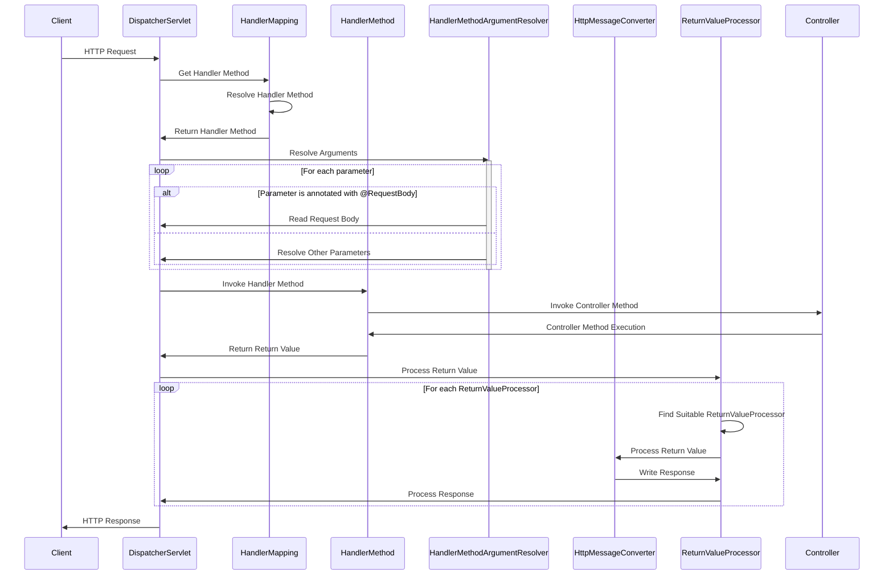

```mermaid
classDiagram
    class HandlerMethodArgumentResolver {
        + supportsParameter(parameter: Parameter): boolean
        + resolveArgument(parameter: Parameter, request: HttpServletRequest, response: HttpServletResponse): Object
    }
    <<interface>> HandlerMethodArgumentResolver

    class HttpMessageConverter {
        + write(value: Object, response: HttpServletResponse, contentType: String): void
        + canWrite(type: Class<?>, contentType: String): boolean
        + getSupportedContentType(): String
        + read(request: HttpServletRequest, targetType: Class<?>): Object
        + canRead(type: Class<?>, contentType: String): boolean
    }
    <<interface>> HttpMessageConverter

    class ReturnValueProcessor {
        + supports(type: Class<?>): boolean
        + processReturnValue(returnValue: Object, method: HandlerMethod, request: HttpServletRequest, response: HttpServletResponse): boolean
    }

    <<interface>> ReturnValueProcessor
    class HandlerMethod {
        - beanType: Class<?>
        - method: Method
        - path: String
        - parameters: Parameter[]
        - bean: Object
        + handleRequest(resolvedArguments: Object[]): Object
    }

    class DispatcherServlet {
        - servletContext: ServletContext
        - returnValueProcessors: List<ReturnValueProcessor>
        - argumentResolvers: List<HandlerMethodArgumentResolver>
        - handlerMappings: List<HandlerMapping>
        + init(config: ServletConfig): void
        + service(req: HttpServletRequest, resp: HttpServletResponse): void
        - processRequest(request: HttpServletRequest, response: HttpServletResponse): void
        - getHandlerMethod(request: HttpServletRequest): HandlerMethod
        - resolveArguments(handlerMethod: HandlerMethod, request: HttpServletRequest, response: HttpServletResponse): Object[]
        - processReturnValue(returnValue: Object, method: HandlerMethod, request: HttpServletRequest, response: HttpServletResponse): void
    }

    DispatcherServlet --> HandlerMethod
    DispatcherServlet --> HandlerMethodArgumentResolver
    DispatcherServlet --> HttpMessageConverter
    DispatcherServlet --> ReturnValueProcessor


```

```mermaid
sequenceDiagram
    participant Client
    participant DispatcherServlet
    participant HandlerMapping
    participant HandlerMethod
    participant HandlerMethodArgumentResolver
    participant HttpMessageConverter
    participant ReturnValueProcessor
    participant Controller
    Client ->> DispatcherServlet: HTTP Request
    DispatcherServlet ->> HandlerMapping: Get Handler Method
    HandlerMapping ->> HandlerMapping: Resolve Handler Method
    HandlerMapping ->> DispatcherServlet: Return Handler Method
    DispatcherServlet ->> HandlerMethodArgumentResolver: Resolve Arguments
    activate HandlerMethodArgumentResolver

    loop For each parameter
        alt Parameter is annotated with @RequestBody
            HandlerMethodArgumentResolver ->> DispatcherServlet: Read Request Body
        else
            HandlerMethodArgumentResolver ->> DispatcherServlet: Resolve Other Parameters
        end
    end

    deactivate HandlerMethodArgumentResolver
    DispatcherServlet ->> HandlerMethod: Invoke Handler Method
    HandlerMethod ->> Controller: Invoke Controller Method
    Controller ->> HandlerMethod: Controller Method Execution
    HandlerMethod ->> DispatcherServlet: Return Return Value
    DispatcherServlet ->> ReturnValueProcessor: Process Return Value

    loop For each ReturnValueProcessor
        ReturnValueProcessor ->> ReturnValueProcessor: Find Suitable ReturnValueProcessor
        ReturnValueProcessor ->> HttpMessageConverter: Process Return Value
        HttpMessageConverter ->> ReturnValueProcessor: Write Response
        ReturnValueProcessor ->> DispatcherServlet: Process Response
    end

    DispatcherServlet ->> Client: HTTP Response

```