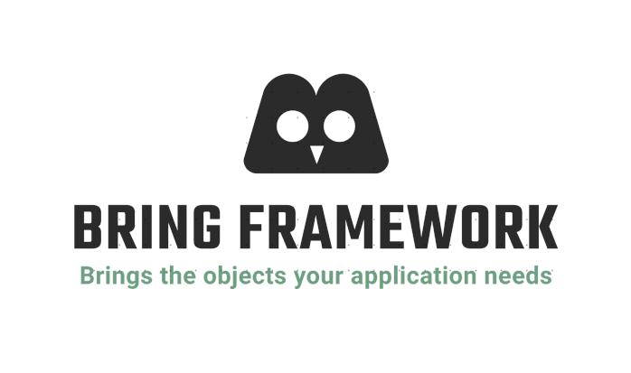
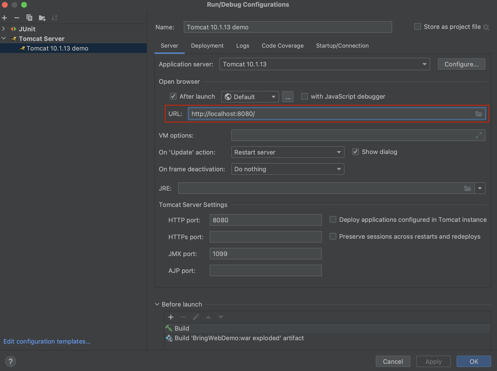
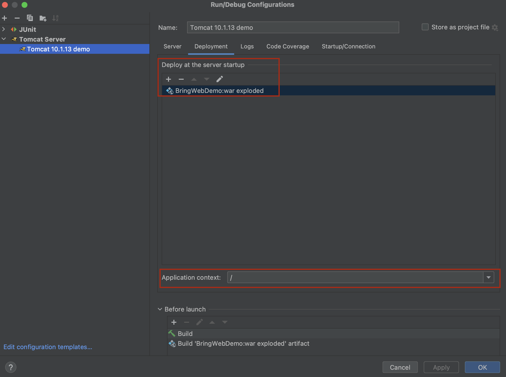

# Hoverla Bring - The Best or Nothing 

[](http://ec2-3-65-176-142.eu-central-1.compute.amazonaws.com:9000/dashboard?id=hoverla-team-2023_HoverlaBring_AYwIBAvijYd-lSknBhZO)
[](http://ec2-3-65-176-142.eu-central-1.compute.amazonaws.com:9000/dashboard?id=hoverla-team-2023_HoverlaBring_AYwIBAvijYd-lSknBhZO)
[](http://ec2-3-65-176-142.eu-central-1.compute.amazonaws.com:9000/dashboard?id=hoverla-team-2023_HoverlaBring_AYwIBAvijYd-lSknBhZO)

In the dynamic and ever-evolving realm of web development, where innovation ignites the digital landscape, the fusion of a robust Web module
and an ingenious Dependency Injection system sparks the flames of creativity and functionality. Welcome to Hoverla Bring!

Within the heart of Hoverla Bring lies a potent Dependency Injection system, a virtuoso conductor orchestrating a symphony of managed
objects and beans. These objects, birthed by the container, are not mere code entities; they are the alchemical fusion of logic and
artistry.
Crafted with precision and nurtured by the inferno of innovation, they stand as a testament to the seamless marriage of form and function.

Hoverla Bring transcends the mundane by infusing inspiration into the very core of its being. The container can be finely tuned and sculpted
with the discovery of Java annotations, turning configuration into a canvas where developers paint with the strokes of their ingenuity.

In the dance of dependency, Hoverla Bring offers not just a routine but a choreography of possibilities. It beckons developers to choose
their rhythm—dependency lookup, a daring act where the caller requests a bespoke creation from the container, or dependency injection,
where objects pirouette gracefully from one entity to another, carried by the rhythmic flow of constructors and properties.

Hoverla Bring, a beacon of inspiration in the coding cosmos, invites developers to embrace the fiery dance of creation. It goes beyond
the ordinary, transcending the mere syntax of programming to illuminate the path of innovation and elegance in web development.
Welcome to a world where code is not just written; it's composed, orchestrated, and brought to life in a symphony of digital brilliance.

# Requirements

___

- **Java**: Version 17 or later.
- **Maven**: Make sure Maven 4.0.0 is installed on your system. You can download it
  from [here](https://maven.apache.org/download.cgi).
- **Tomcat(Required for Bring Web only)**: Make sure you have Tomcat 10.1.13 or later is installed on your system
  You can download it from [here](https://tomcat.apache.org/download-10.cgi).

# Getting Started Bring context

___
Follow these steps to get started with our project:

1. **Clone the Repository:**
   ```bash
    git clone https://github.com/hoverla-team-2023/HoverlaBring
    cd HoverlaBring
    ```

2. **Build the Project:**
   ```bash
    mvn clean install -Dmaven.test.skip=true
    ```

3. **Add the Project as a dependency:**
   ```xml
    <dependency>
      <groupId>org.bobocode.hoverla.bring</groupId>
      <artifactId>BringContext</artifactId>
      <version>1.0-SNAPSHOT</version>
    </dependency>
    ```
4. **Run the application:**
    ```java
      public class BringDemo {
        public static void main(String[] args) {
          HoverlaApplicationContext hoverlaApplicationContext = new HoverlaApplicationContext("{Path to your components}");
     }
   }
   ```

# Get Started Hoverla BringWEB

___
Follow these steps to get started with our project:

1. **Clone the Repository:**
   ```bash
    git clone https://github.com/hoverla-team-2023/HoverlaBring
    cd HoverlaBring
    ```

2. **Build the Project:**
   ```bash
    mvn clean install -Dmaven.test.skip=true
    ```

3. **Add the Project as a dependency:**
   ```xml
    <dependency>
      <groupId>org.bobocode.hoverla.bring.web</groupId>
      <artifactId>BringWeb</artifactId>
      <version>1.0-SNAPSHOT</version>
    </dependency>
    ```
4. **Run the application:**
   **Important**: You should package your application as war and deployed to Tomcat before your start.
   To initialize a dispatcher servlet you need to introduce a new class in classpath, witch extends AbstractDispatcherServletInitializer.
   This class will then be scanned and initialized automatically. Please note that the class should have a public no-args constructor.

   ```java
   import org.bobocode.hoverla.bring.web.initializers.AbstractDispatcherServletInitializer;
    public class DispatcherServletConfiguration extends AbstractDispatcherServletInitializer {
    @Override
    public String getPackagesToScan() {
    return "{Path to your components controllers and controller advices}";
    }}
    ```
5. **Add the Maven build plugin and set packaging to war :**
   ```xml
    <build>
    <plugins>
      <plugin>
        <groupId>org.apache.maven.plugins</groupId>
        <artifactId>maven-war-plugin</artifactId>
        <version>3.4.0</version>
      </plugin>
    </plugins>
   </build>
    ```
   ```xml
    <packaging>war</packaging>
    ```

- **Configuration to start**: if you're running from IntelliJ Idea this en example bellow:
  
  

**You can see the Hoverla HelloWorld application in module BringWebDemo**


# Hoverla  quirks and features

___

### Hoverla Application Context

- **[HoverlaApplicationContext](#hoverlaApplicationContext)**: The application context is the central interface within a Hoverla-Bring 
- application for providing configuration information to the application.
- **[@Component](#component)**: These annotations are used to indicate that a class is a source of bean definitions.
- The @Component annotation is a class-level annotation.
- **[@Autowired](#autowired)**: This annotation provides control over where and how autowiring should be accomplished. It can be used 
- to autowire bean on the setter method, constructor, a property, or methods with arbitrary names and/or multiple arguments.
- **[@Scope](#scope)**: This annotation is used to specify the scope of the beans. It allows you to set the BeanScope value to Singleton.
- **[BeanPostProcessor](#beanPostProcessor)**: This is a hook that allows for custom modification of new bean instances, 
- for example, checking for marker interfaces or wrapping them with proxies.
- **[BeanFactoryPostProcessor](#beanFactoryPostProcessor)**:This is the hook that can be invoked after scanning and before 
- the instantiation of  bean objects.


### Hoverla Web 
- **[Controller](#controller)**: Controllers in Hoverla-Bring are responsible for processing incoming HTTP requests and returning responses. 
- Controllers are defined by adding the @Controller annotation to the class.
- **[ControllerAdvice](#controllerAdvice)**: This annotation is used to define global advice that is shared across 
- multiple `@Controller` classes.
- **[ExceptionHandler](#exceptionHandler)**: This annotation is used to handle exceptions that are thrown during the execution 
- of `@RequestMapping` methods.
- **[PathVariable](#pathVariable)**: This annotation is used to bind a method parameter to a URI template variable.
- **[QueryParam](#queryParam)**: This annotation is used to extract query parameters from the Request URI.
- **[RequestBody](#requestBody)**: This annotation is used to bind the HTTP request body with a method parameter.
- **[ResponseBody](#responseBody)**: This annotation is used to bind the HTTP response body with a method return value.
- **[RequestMapping](#requestMapping)**: This annotation is used for mapping web requests onto specific handler classes
- and/or handler methods.
- **[StatusCode](#statusCode)**: This annotation is used to specify the HTTP status code for the response.
- **[ResponseEntity<T>](#responseEntity)**: This class represents a response entity that contains a body, headers, and a status code.
- **[RequestEntity<T>](#requestEntity)**: This class represents an HTTP request entity with headers and a body.

# Application context

This is a Java application that creates an instance of the `HoverlaApplicationContext` class, 
which is a framework for managing and creating objects in a Java application. 
The main method of the application retrieves an instance of the HoverlaApplicationContext class and uses it to create objects 
by implementing class name and interface.
___

Example:

```java
public class Application {

  public static void main(String[] args) {
    HoverlaApplicationContext hoverlaApplicationContext = new HoverlaApplicationContext("{Path to your components}");
    // You have to get created bean : by interface and Bean Name(for Bean Name generating is responsible 
    // :BeanUtils.generateBeanName(Your Class))
    // please see examples below 
    Object byImplementedClassName = context.getBean(BeanUtils.generateBeanName(MyServiceImpl.class));
    Object byInterface = context.getBean(MyService.class);

  }

}
```
---

### @Component and @Autowired


Creation custom components which  will be maneged by BringContext.

`@Component` is used to declare a class as a Bring bean, indicating that it should be managed by the Bring IoC 
This annotation is often applied to classes that represent services, 
repositories, or other components in a Bring application.

On the other hand,`@Autowired`is used to inject dependencies automatically. 
When Bring encounters this annotation, it looks for a compatible bean in its container and 
injects into.

Example:


```java

@Component
public class UtilService {

  @Autowired
  private MessageService messageService;

}

@Component
public class MessagingService {

  @Autowired
  private CommonService commonService;

  public CommonService getCommonService() {
    return commonService;
  }

}

public interface CommonService {}

@Component
public class CommonServiceImpl implements CommonService {

}
```

---
### @Scope


Creation custom scope on Component annotated class with returns single instance of class for every bean.
For example, when you annotate a class with `@Scope`("singleton"), it means that a single instance of 
the bean will be created and shared everywhere.

Example:
```java
@Component
@Scope(BeanScope.SINGLETON)
public class MessageService implements CustomService {

    private String hello = "Hello from Hoverla";

    public String getMessage() {
        return hello;
    }

}
```

---
### Interface - BeanFactoryPostProcessor


BeanFactoryPostProcessor is processor that is executed bt BeanFactory after scanning by path finished.
Interface used to modify bean definitions before the beans are instantiated. 
It provides a hook to customize the configuration of beans at the factory level.

Example:
```java

public class HoverlaBeanFactoryPostProcessor implements BeanFactoryPostProcessor {
  public HoverlaBeanFactoryPostProcessor(String path, List<BeanFactoryPostProcessor> beanFactoryPostProcessors, List<BeanPostProcessor> beanPostProcessors) {
    addCustomProcessors(beanFactoryPostProcessors, beanPostProcessors);
    beanDefinitionScanner.loadBeanDefinitions(path);
    beanFactory.getBeanFactoryPostProcessors().forEach(bfpp -> bfpp.postProcessBeanFactory(beanFactory));
    this.doProcessBeans();
  }
}

```
---
### Interface - BeanPostProcessor


Interface used to perform additional processing after the instantiation of beans. 
It provides a hook to customize or enhance the behavior of beans after they are created.
You can create and manage internal Bean creation processes implementing own custom processors.

Example:
```java

public class HoverlaBeanPostProcessor implements BeanPostProcessor {
  @Override
  public Object tryToInitializeSingletonBean(String beanName) {
    if (beans.containsKey(beanName)) {
      return beans.get(beanName);
    }
    Object createdBean;
    for (BeanPostProcessor bpp : beanPostProcessors) {
      createdBean = bpp.postProcessBean(createdBean, beanName);
    }
    beans.put(beanName, createdBean);
    return createdBean;
  }
}

```

___

# HTTP Server

To initialize a dispatcher servlet you need to introduce a new class in classpath, witch extends `AbstractDispatcherServletInitializer`.
This class will then be scanned and initialized automatically. Please note that the class should have a public no-args constructor.
___

Example:

```java
import org.bobocode.hoverla.bring.web.initializers.AbstractDispatcherServletInitializer;
public class DispatcherServletConfiguration extends AbstractDispatcherServletInitializer {
  @Override
  public String getPackagesToScan() {
    return "{Path to your components controllers and controller advices}";
  }}

```
___
### @Controller

To register a controller just mark your class with `@Controller` annotation. After that you are able to introduce your own endpoints
by marking them with `@RequestMapping` annotation.

Example:

```java

@Controller
public class MyBobocodeController {

  @RequestMapping(path = "/bobocode/hoverla", method = RequestMethod.GET)
  public TeamDTO helloWorld() {
    return new TeamDTO("hoverla", Map.of(
      "test1", "user1",
      "test2", "user2"
    ));
  }

}

record TeamDTO(String team, Map<String, String> teammates) {
}
```
___

### @ControllerAdvice
You can handle exceptions in a flexible and customizable manner by relying on exception handler methods defined in controller advice
classes. Controller advice classes can be annotated with `@ControllerAdvice`, and exception handler methods within those classes are
annotated with `@ExceptionHandler`.

Example:
```java
@ControllerAdvice
public class YourGlobalControllerAdvice {

@ExceptionHandler(YourCustomException.class)
@StatusCode(value = 400)
public BringError handle(YourCustomException exception) {
return new Error(exception.getMessage());
}

record Error(String errorMessage) {}
}
```
___
### @PathVariable
PathVariable is used to extract values from the URI path in Hoverla-Bring. It is often used to capture dynamic values in the URL.
Supports the resolution of various parameter types, including primitive types, their wrapper classes, String, Enum, and collections (List,
Set).

Example:
```java
@RequestMapping(path = "/bobocode/hoverla/{id}", method = RequestMethod.GET)
public ResponseEntity<String> getEntityById(@PathVariable("id") Long id) {
// Logic to fetch entity by id
return ResponseEntity.ok("Entity with ID: " + id);
}
```
___
### @QueryParam
QueryParam is used to extract values from query parameters in Hoverla-Bring. It allows you to access values passed in the URL query string.
Supports the resolution of various parameter types, including primitive types, their wrapper classes, String, Enum, and collections (List,
Set).
Example:
```java
@RequestMapping(path = "/bobocode/hoverla", method = RequestMethod.GET)
public ResponseEntity<String> getEntitiesByType(@QueryParam("type") String entityType) {
// Logic to fetch entities by type
return ResponseEntity.ok("Entities of type: " + entityType);
}
```
___
### Request/Response objects

The Bring Framework supports `application/json` and `text/plain` content types. Thus, all POJOs that are returned by the servlet
are converted to JSON, and all primitive values are returned as `text/plain`. Also, if you want to receive an object in endpoint, it should
be sent in JSON format.
To mark an endpoint argument as the request body, annotate it with `@RequestBody` annotation. Also, you can use `RequestEntity<T>` argument
type instead. It will give you access to the request body and request headers.

Example:

```java
@RequestMapping(path = "/bobocode/hoverla-request-body-list", method = RequestMethod.POST)
public void testRequestBodyDtoList(@RequestBody List<TestDto> body){
  System.out.println(body);
  }

@RequestMapping(path = "/bobocode/hoverla-request-entity", method = RequestMethod.POST)
public void testRequestEntity(RequestEntity<TestDto> requestEntity){
  System.out.println(requestEntity);
  }
```
___

### @RequestMapping
RequestMapping is used to map web requests to specific methods or classes in Hoverla-Bring. It allows you to define the URL patterns and
HTTP methods that trigger the execution of a method.

Example:

```java
@RequestMapping(path = "/bobocode/hoverla", method = RequestMethod.GET)
public ResponseEntity<String> helloWorld() {
return ResponseEntity.ok("Hello, Hoverla!");
}
```
___

### @StatusCode
You can mark your method with `@StatusCode` annotation to provide status code for the response:

```java
@StatusCode(202)
@RequestMapping(path = "/bobocode/hoverla-dto", method = RequestMethod.GET)
public List<TeamDTO> helloWorldDto(){
  var dto=new TeamDTO("hoverla",Map.of(
  "test1","user1",
  "test2","user2"
  ));
  return List.of(dto);
  }
```
___
### ResponseEntity
`ResponseEntity<T>` return type gives an ability to specify response body, headers, and status code:

```java
@RequestMapping(path = "/bobocode/training", method = RequestMethod.GET)
public ResponseEntity<String> training(){
  return new ResponseEntity<>(
  "hoverla",                                     // response body
  Map.of("My-Header",List.of("testValue")),     // response headers
  201                                            // response status code
  );
  }
```
___
Also, you can inject additional jakarta objects into your endpoint. Such as:

- request - `HttpServletRequest`
- response - `HttpServletResponse`
- session - `HttpSession`
- servlet context - `ServletContext`
- cookies - `Cookie[]`, or `List<Cookie>`, or `Set<Cookie>`

Example:

```java
@RequestMapping(path = "/bobocode/hoverla-servlet-objects", method = RequestMethod.GET)
public void testServletObjects(HttpServletRequest request,
  HttpServletResponse response,
  HttpSession session,
  ServletContext context,
  Cookie[]cookiesArray,
  List<Cookie> cookieList,
  Set<Cookie> cookieSet){

  session.setAttribute("hello","world");
  }
```
___

### RequestEntity
`RequestEntity<T>` This class represents an HTTP request entity with headers and a body.:

```java
public Object resolveArgument(HttpServletRequest request, HttpServletResponse response) {
  var body = readRequestBody(genericType, request);
  return new RequestEntity<>(getHeaders(request), body); // request body
  }
```
___
